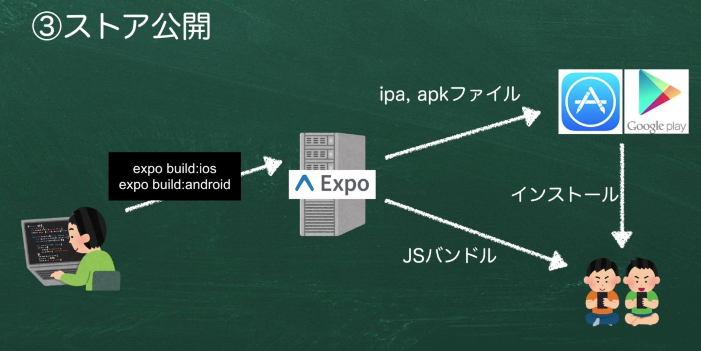

# アプリを広める

1. 社内や知人にテスト用アプリを配布する
2. iOSのストア申請
3. Androidのストア申請

## Expoでのアプリの配信方法

1. 開発中
2. 社内で動作確認
3. ストア公開

### 1. 開発中

開発者のMac → JSバンドル → シミュレーターや実機 + Expo Clientアプリ

開発中はExpoクライアントが入っていて、そこで動作している。

### 2. 社内で動作確認

エンジニア → Expo → Expo Clientアプリ

・エンジニア → Expo
`expo publish`で実行する事ができます。

・Expo → Expo Clientアプリ
JSバンドルをExpo Clientアプリに配信します。

### 3. ストア公開

Expoのサーバーがビルドしてくれるので、簡単にビルドする事ができる。
また、起動時に、ExpoのサーバーからJSバンドルをダウンロードするため、利用者は最新のアプリを利用する事ができる。



## Expo Publishの方法について

[公式のページ](https://docs.expo.io/workflow/publishing/)
を参考に進めていきます。

コマンドラインで、`expo publish`を実行するか、Expoのプロジェクト起動時に表示されるWebブラウザ（localhost:19002）の
`Publish or republish project…`を選択する事でも、実行する事が出来ます。

ビルド完了後にURLが表示されるので、そのURLにアクセスすると、アプリの導入方法についての記載がされています。
Androidの場合、 Expoクライアントアプリで表示されているQRコードを読み込む事でアプリをダウンロードする事ができます。

iOSの場合は、Expoクライアントアプリで、同じアカウントでログインして、使用します。

## ストア公開用のビルドについて

### release-channelについて

publishする場合に、`--release-channel`オプションを指定すると、名前をつけて管理する事が出来ます。

本番アプリをビルドする際に、release-channelを指定する事で、どのJSバンドルを利用するかを選択する事ができる。

`expo publish`
`expo publish --release-channel production`

### iOS申請用のアプリについて

[スタンドアロンビルドの方法](https://docs.expo.io/distribution/building-standalone-apps/)
にも記載されている方法でビルドを実行します。

`app.json`の内容を調整する必要があるので、設定を確認します。

`expo build:ios --release-channel production`でビルドを実行します。

実行後、下記の質問が表示されるので、矢印キーで選択します。

```sh
Choose the build type you would like: (Use arrow keys)
❯ archive - Deploy the build to the store
  simulator - Run the build on a simulator
```

今回は、スタンドアロンアプリで確認を行いたいので、simulatorを選択します。[詳細が記載されているページ](https://docs.expo.io/distribution/building-standalone-apps/#if-you-choose-to-build-for-ios)
