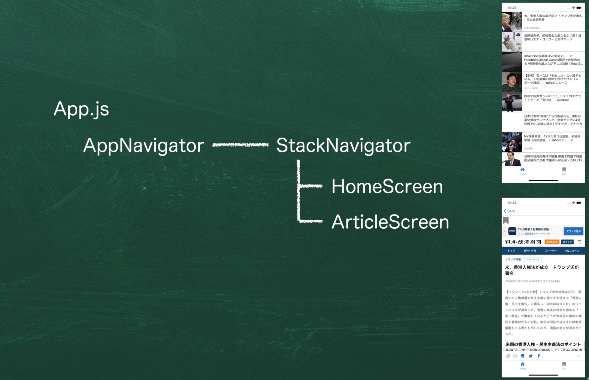

# 画面遷移について

## stackNavigatorについて

上に積み重なっていくような画面遷移を設計するためのもの



AppNavigatorの下に、StackNavigatorを配置します。

## アロー関数作成時のエラー

変更した際にエラーが発生した場合はExpoを再起動してみる。

下記のエラーが発生した時は再起動で直った

```SH
Error: Couldn't find a 'component' or 'children' prop for the screen 'Home'. This can happen if you passed 'undefined'. You likely forgot to export your component from the file it's defined in, or mixed up default import and named import when importing.
```

## タッチした際にアクションを発生する場合

TouchableOpacityモジュールを利用します。

[公式のページ](https://reactnative.dev/docs/touchableopacity)

## React Navigationで画面間の遷移を実装する場合

Moving between screenを利用して実装する。

[公式のページ](https://reactnavigation.org/docs/navigating/)

## 画面遷移間のパラメータ受け渡し

[Passing parameters to routes](https://reactnavigation.org/docs/params/)
上記のページに詳しい内容が記載されています。
