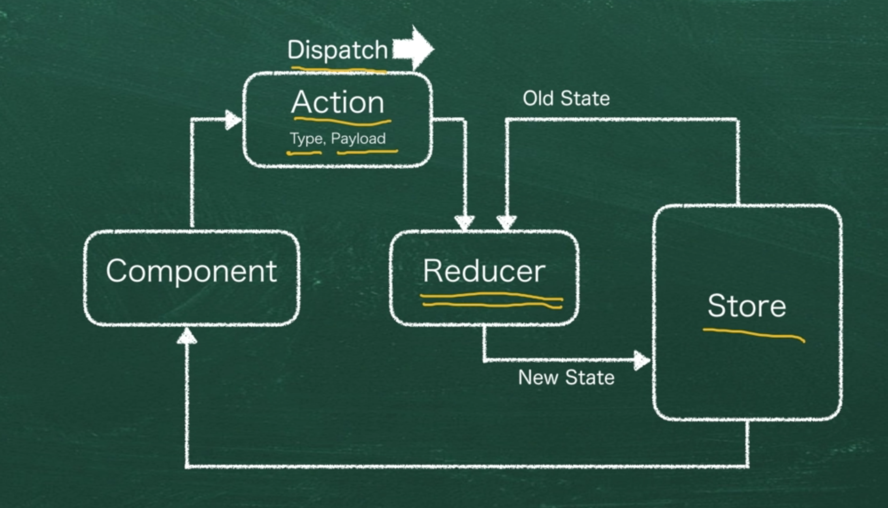
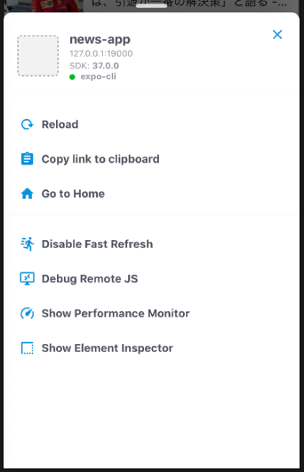

# Reduxとは

状態を管理するために必要な機能である。

reduxは状態を管理するためのstoreを提供してくれる。

## ComponentがStoreの情報を更新するまでの流れ

ComponentがActionをDispatchする。
Actionの中にはTypeとPayloadを持っている。

ActionがReducerへ伝わると、新しい状態をstoreに保存する。
その後、storeからComponentへ変更が伝わる。



## React Native Debuggerを利用して開発を行う

[React Native Debuggerのページ](https://github.com/jhen0409/react-native-debugger)

下記のコマンドでインストールします。
`brew update && brew cask install react-native-debugger`

## redux-devtools-extensionを導入する

`yarn add redux-devtools-extension`

`index.js`の`createStore`の第二引数にcomponentWithDevToolsを引数として与えます。

```js
const store = createStore(rootReducer, componentWithDevTools);
```

## React Native Debuggerを起動する

React Native Debuggerは起動時に`Port 8081`となっているが、ExpoのPortは`19001`ポートなので、設定して、起動しなおします。
上部のメニューバーから、`Debugger` → `New Window`を選択して、新しいウィンドウを開きます。
ウィンドウを開く際に、Portの指定を聞かれるので、`19001`と入力して起動します。

新しいウィンドウが起動したら、接続を行います。

### シミュレータとの接続方法

シミュレータで`Cmd + D`を押します。


上記のような画面が表示されると思いますので、`Debug Remote JS`を選択します。
