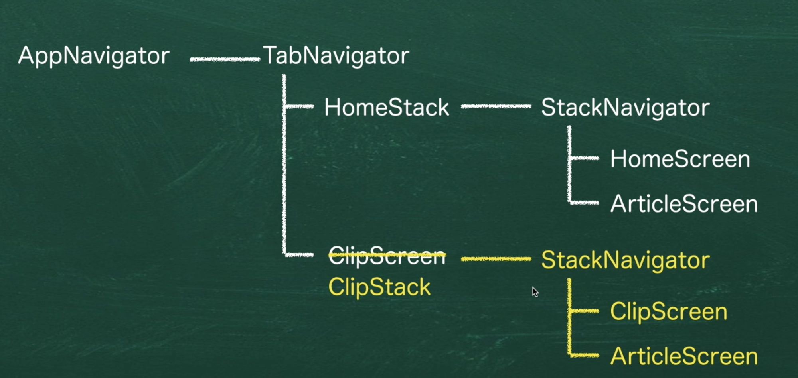

# 画面にタブを表示する

## 情報ページ

画面にタブを表示する場合は、`createBottmTabNavigator`を利用します。

詳細は、[こちらのページ](https://reactnavigation.org/docs/bottom-tab-navigator/)を参考にしてください。

## 導入方法

まず初めに必要なパッケージを追加します。
`yarn add @react-navigation/bottom-tabs`

## コードの変更

サンプルのコードを参考にして、コードを変更します。

## アインコンを追加する方法

[こちらのページ](https://reactnavigation.org/docs/material-bottom-tab-navigator/#options)のアイコンの部分を参考にアイコンを表示します。

また、Expoを利用している場合は、Expoのアイコンを利用する事も可能です。

[アイコンの一覧](https://icons.expo.fyi/)
[Expoアイコンの利用方法](https://docs.expo.io/guides/icons/#expovector-icons)

## Clipにstoreの内容を表示する

useSelectorを利用する
[こちらのページ](https://react-redux.js.org/7.1/api/hooks#useselector)

useSelectorはReduxの内容を読み込めるようにしてくれる物である。

## ArticleScreenについて

以前の構成だと、HomeScreenにしか、ArticleScreenがなかったため、記事の詳細表示をしようとすると、Home側に遷移してしまっていた。  
Clip側にも、詳細画面(ArticleScreen)を配置する必要がある。

